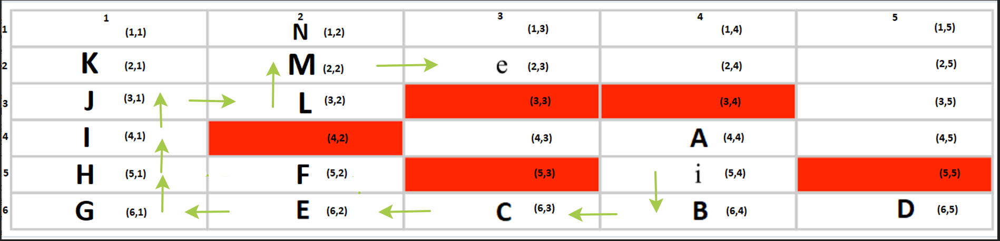
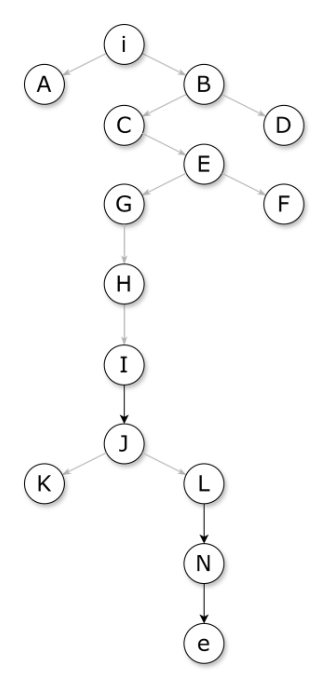

# Búsqueda en Profundidad (DFS) 
## Enunciado del Problema

Se debe encontrar un camino desde la posición inicial `i` hasta la posición destino `e` en una cuadrícula de 6 filas por 5 columnas. El personaje puede moverse únicamente en dirección **arriba, abajo, izquierda y derecha**, pero no puede atravesar obstáculos representados en el mapa.&#x20;

### Reglas del problema:

1. Se debe seguir la estrategia de **búsqueda en profundidad (DFS)** utilizando el criterio **LIFO (Last In, First Out)**.
2. Se generan nodos en el orden **arriba, abajo, izquierda, derecha**.
3. Si un nodo explorado no tiene más movimientos posibles, se retrocede al nodo anterior.
4. La solución óptima será el camino encontrado eliminando los nodos sin salida.

## Representación Visual del Problema

### Mapa inicial con coordenadas

## Solución Implementada

Se ha aplicado **búsqueda en profundidad (DFS)** siguiendo la estrategia **LIFO**, asegurando que en cada paso se prioricen los movimientos en el orden predefinido(arriba, abajo, izquierda, derecha). Se han utilizado estructuras de datos para **gestionar la frontera de exploración** y **almacenar los nodos explorados**.

### Tabla de búsqueda en profundidad

La exploración completa se detalla en el siguiente archivo:
[🔗 Tabla de búsqueda en profundidad](tabla_de_busqueda.md)

## Representación de la Solución

### Mapa con la ruta óptima

## Explicación de la Solución

1. Se inicia en el nodo `i` y se exploran los movimientos disponibles en el orden predefinido.
2. Se expanden los nodos utilizando **LIFO**, lo que implica que siempre se explorará el último nodo añadido a la frontera.
3. Cuando un nodo no tiene más movimientos disponibles, se retrocede al anterior y se sigue explorando.
4. Los nodos sin salida se eliminan en el momento en que se detectan, como en el caso del nodo `D` en el paso 3. Una vez alcanzado el destino `e`, se obtiene la ruta óptima sin los nodos descartados.

## Árbol de búsqueda generado

  

Esta solución muestra la estrategia completa utilizada en DFS y cómo se ha logrado encontrar el camino correcto eliminando los nodos no útiles.

---

